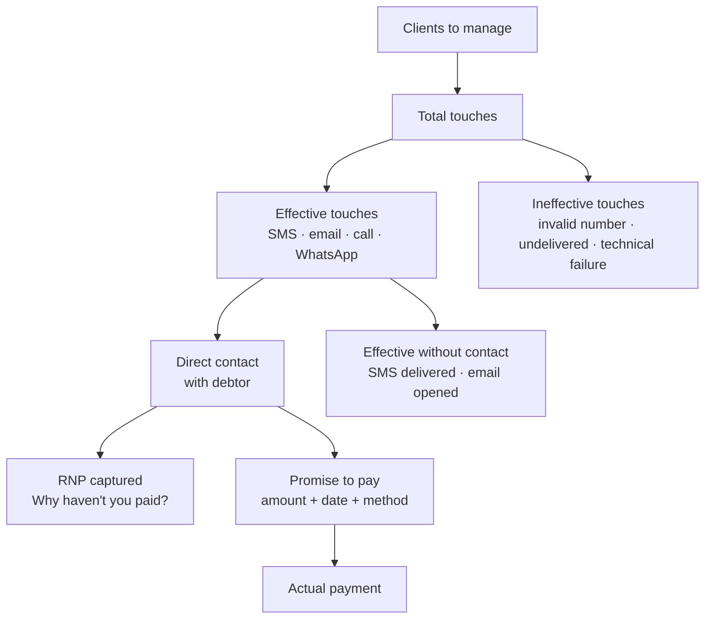

# POL-006: Operational Monitoring Governance Policy

## Purpose

Define the governance framework for [[FinCo]]'s operational monitoring, the principles that determine what is measured, at what frequency, at what resolution level, and with what action thresholds. This policy sets the standard against which dashboards, review SOPs, and collection engine design decisions are evaluated.

*Primary source: knowledge extraction session with [[Carlos-Ruiz]], Director of Operations, 2026-07-01.*

## Applicable regulatory framework

- **applicable local debt-collection regulations**: Collection regulation and debtor relationship in the Dominican Republic
- **Criminal Procedure Code**: Framework applicable to judicial seizure processes (effective August 2026)
- **INDOTEL**: Telecommunications regulations (voice and SMS channels)
- **Proconsumidor**: Consumer rights in collection activities

---

## Principles

**1. Real-time monitoring is not optional for the collection operation.**
Operational dashboards update with frequency ≤2 hours during active campaign days. The temporal resolution of monitoring directly determines maneuverability: seeing the problem mid-day allows correction; seeing it at end-of-day only allows diagnosis. Seeing results monthly is equivalent to being unable to act.

**2. The collection funnel is the reference analytical model.**
The operation is understood as a production funnel. The performance of each stage conditions the next. The Reason for Non-Payment (RNP) is not a final result; it is captured during direct contact with the debtor, in parallel with the promise to pay, when the client explains why they have not paid (unemployment, unexpected expense, health issue, etc.).

This model is the primary lens for diagnosing where performance is lost in the operation.

**3. Funnel indicators are read as aggregate ratios, not individual chains.**
The funnel is not monitored by tracing each individual touch's journey (this call → this contact → this promise → this payment). It is monitored as an aggregate proportion: today 3,000 touches were made, 2,000 were effective, 100 produced promises, 10 produced payments. Trying to individually tie each touch to its final result makes the monitoring system unmanageable. Ratios between stages are the diagnostic instrument.

Direct consequence: funnel numbers only have statistical meaning when the pipeline is full, which occurs approximately one to two months into continuous operation. During the startup period, data is directional, not conclusive.

**4. Effective touches predict payments; total touches do not.**
Gross touch volume is not a valid KPI in isolation. The effectiveness rate (effective touches ÷ total touches) is the leading indicator of recovery. Payments are proportional to effective touches, not to the total. Maximizing ineffective touches is burning resources without results.

**5. Input quality determines the engine's ceiling, not its viability.**
A portfolio with only names and phone numbers is sufficient to launch a valid campaign. Demographic segmentation (gender, age, residence) is an enrichment that increases strategy depth and personalization, but its absence does not prevent operation. Without enrichment, the strategy is flat and uniform; it works, but without nuance. With complete demographic data, the engine can segment, personalize prompts, and assign collectors optimally. The difference in effectiveness can be substantial: a degraded database can reduce the contactability rate from ~40% (industry benchmark) to 10–20%.

**6. Technical failure and strategy failure are different diagnoses requiring different responses.**
The monitoring system must distinguish:
- **Technical failure:** many touches, zero or very few promises. Typical causes: lost audio in calls, undelivered SMS, telephone exchange failure.
- **Strategy failure:** technically successful touches but no conversion. Typical causes: outdated database, incorrect segmentation, inadequate prompts.

Misdiagnosis leads to wrong remedies. A technical failure is not solved with better prompts.

**7. A promise to pay requires exactly three fields. No exceptions.**
To register as a valid promise, an interaction must capture: (a) specific amount, (b) specific date, (c) specific payment method. If any of the three is missing, it is recorded as an "attempt," not a promise. This standard protects the funnel's integrity and cannot be relaxed under operational pressure.

**8. The maximum acceptable promise horizon is 10 days.**
Promises with a horizon exceeding 10 days do not stop management, the engine continues contacting the client with the recorded promise as context. A distant promise without active follow-up is a known evasion vector: the debtor who promises to pay in 25 days accumulates 24 days without being managed.

**9. The Reason for Non-Payment (RNP) is the second most valuable asset a touch can produce.**
Not recovering payment is not a complete failure if the touch produces a documented RNP. The RNP feeds the creditor's risk model, enables designing personalized responses (refinancing for unemployment, discount for illness) and is a competitive differentiator for [[FinCo]] versus conventional collection operators.

**10. Four cadence tiers govern monitoring.**
Operational monitoring occurs at four frequency levels with distinct purposes:

| Tier | Cadence | Purpose |
|---|---|---|
| 1 | Every 1–2 hours | Operational pulse, detect and correct within the day |
| 2 | Daily close | Day summary, diagnosis and funnel closure |
| 3 | Weekly review | Trends, campaign strategy adjustment *(draft)* |
| 4 | Monthly review | Strategic governance, report to management and creditors *(draft)* |

Tiers 3 and 4 are marked as *draft* pending validation with [[Carlos-Ruiz]] and [[Mateo-Herrera]] (strategy engine session).

---

## Operational rules

1. Active campaign dashboards update with frequency ≤2 hours on operating days. The aspirational standard is hourly updates.
2. Actively pursue SMS and voice providers that supply delivery reports, and base payment on effectively delivered messages, not attempts. Where the market does not offer this, document the gap and prioritize provider replacement as soon as an alternative is available.
3. The debtor's demographic data (gender, age, residence, amount) is a desirable enrichment requested in every onboarding process. If the creditor does not supply it, the campaign launches with a flat strategy (names and phones) and the limitation is noted in the client file.
4. The update frequency for days-delinquent in external portfolios must be at least daily. Strategies applied to outdated delinquency data produce contacts inconsistent with the debtor's reality.
5. The alert thresholds defined in [[SOP-008_Operational-Monitoring]] are mandatory. When a threshold is crossed, the escalation protocol is activated within a maximum of 30 minutes.
6. The pipeline is continuous, a July touch can produce a payment in September. Reports record results when they occur, without attempting to attribute them to the originating period. The only metric that requires individual case tracing is the kept promise rate: to know if a promise converted to payment, that specific case must be tracked. Ratio benchmarks are only statistically valid when the pipeline has been operating for at least 30 days.

---

## Non-compliance

Violations of principle 7 (invalid promise registered as a promise) and principle 1 (dashboards not updating at the established frequency) are reported to the [[JD-Operations-Manager|Operations Manager]] and [[Chief-of-Staff]] as high-priority operational incidents, documented in Slack's `#finco-ops`.

---

*FinCo-OS · POL-006 · 2026-07-02*
